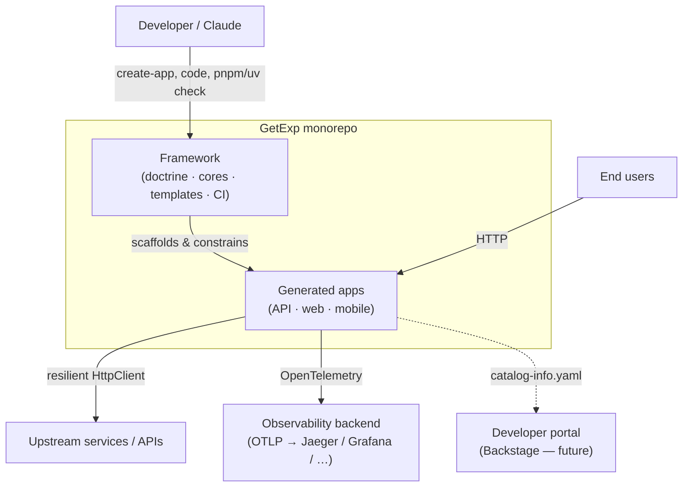
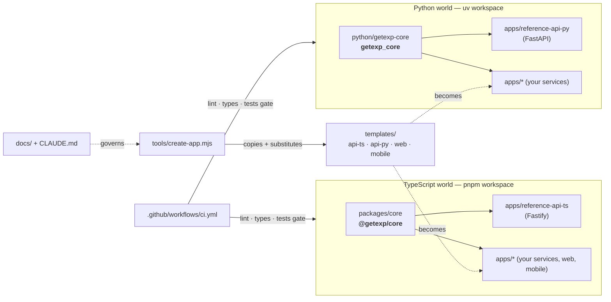
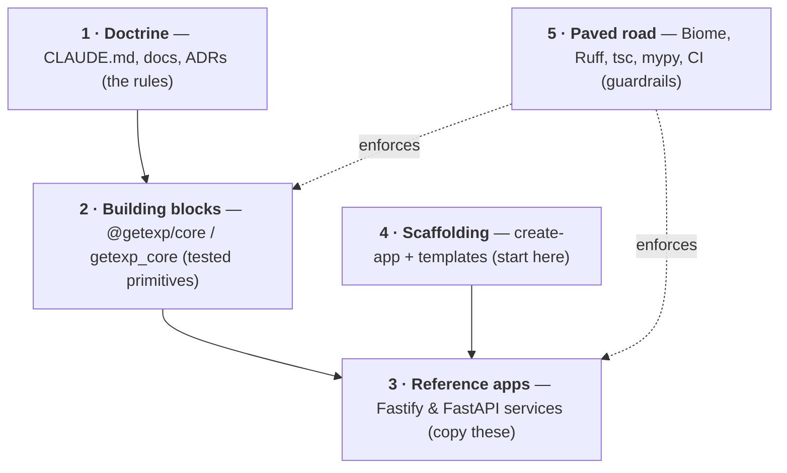
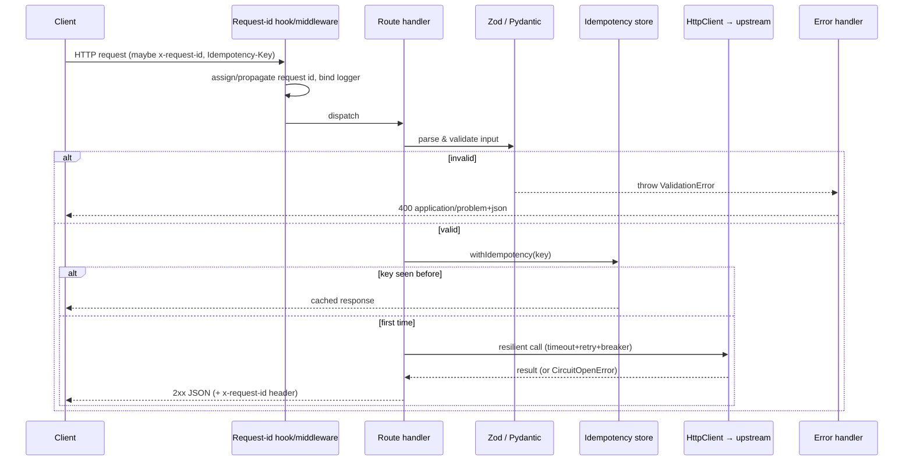
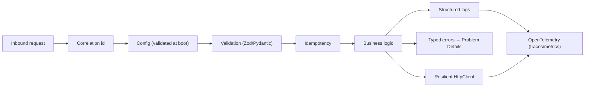
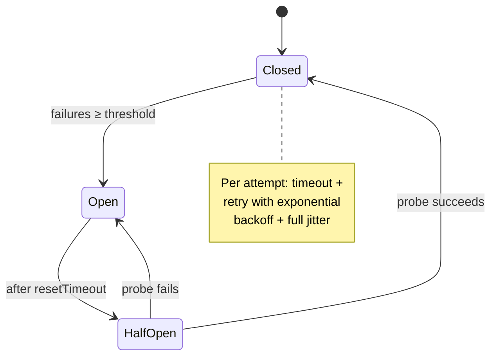
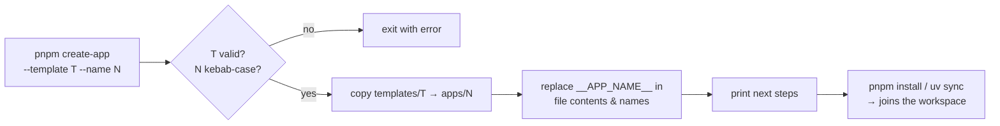
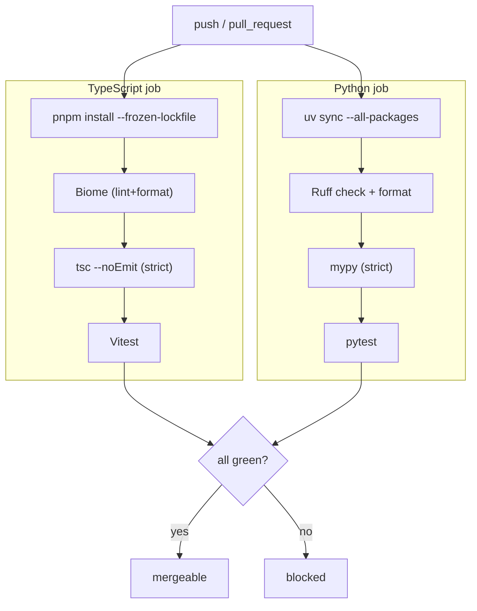
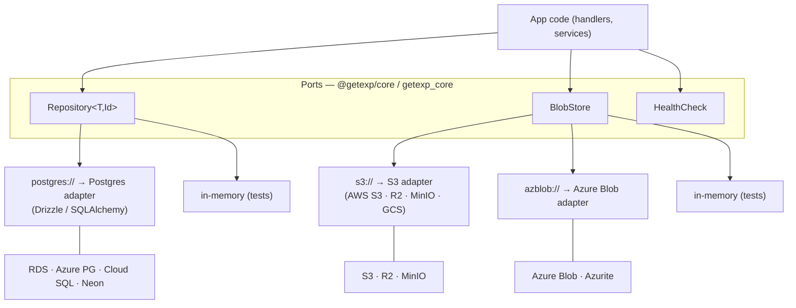

# GetExp Framework — High-Level Design

> Status: living document · Last updated: 2026-05-31 · Audience: engineers
> (human and AI) building or extending apps on the framework.

This is the architectural overview of the GetExp framework: what it is, how the
pieces fit, and why. For the operating rules see [`../CLAUDE.md`](../CLAUDE.md);
for the rationale see [`golden-path.md`](golden-path.md); for the industry
lineage see [`upstream-oss.md`](upstream-oss.md).

---

## 1. Purpose & design goals

GetExp is an **opinionated "Golden Path"**: a single blessed way to build APIs,
web and mobile apps, with shared, pre-tested building blocks for every
cross-cutting concern. The goal is to spend engineering time on product, not on
re-deciding and re-debugging foundations.

| Goal | How the design serves it |
| --- | --- |
| **Low time-to-feature** | Scaffold a wired-up app in one command; import building blocks instead of writing plumbing. |
| **Few surprises / low debugging** | One frozen choice per concern; pinned versions; everything tested and type-checked. |
| **Consistency across apps & languages** | The same primitives, names and contracts in TypeScript *and* Python. |
| **Safe to extend** | New capability goes into the core (with tests); deviations need an ADR. |
| **AI-buildable** | Small, fixed, documented surface area → Claude has little to get wrong. |

### Non-goals
- Not a runtime/PaaS — it does not deploy or host anything.
- Not a plugin marketplace — it is intentionally narrow and opinionated.
- Not multi-stack — exactly two ecosystems (TS, Python), by design.

---

## 2. System context (C4 — level 1)



The framework sits between the developer and the apps: it generates them and
constrains how they are built. Apps expose HTTP to users, call upstreams only
through the resilient client, and emit telemetry via OpenTelemetry.

---

## 3. Repository topology (C4 — level 2)



Two language workspaces share one repo, one doctrine, one CI. Each has a single
shared core package that every app depends on.

---

## 4. Layered architecture



1. **Doctrine** — the frozen stack and the rules.
2. **Building blocks** — the code you import.
3. **Reference apps** — runnable proof + copy targets.
4. **Scaffolding** — generates apps pre-wired with 1–3.
5. **Paved road** — automated guardrails that keep apps on the path.

---

## 5. Building-blocks catalog

Both cores expose the **same** primitives with mirrored names (TS camelCase /
Python snake_case). Detailed API + examples in [`reference.md`](reference.md).

| Block | Concern | TypeScript (`@getexp/core`) | Python (`getexp_core`) |
| --- | --- | --- | --- |
| **Result** | Explicit success/failure | `ok` `err` `isOk` `map` `fromPromise` | `ok` `err` `is_ok` `map_ok` `from_awaitable` |
| **Errors** | Typed errors → RFC 7807 | `AppError` family, `toProblemDetails`, `toAppError` | `AppError` family, `to_problem_details`, `to_app_error` |
| **Logger** | Structured JSON + request id | `createLogger` / `loggerOptions`, `withRequestId` | `configure_logging`, `get_logger`, `with_request_id` |
| **Config** | 12-factor, validated at boot | `loadConfig` (Zod), `env` helpers | `load_config` (Pydantic), `ConfigError` |
| **HttpClient** | Resilient outbound calls | `HttpClient` (timeout/retry/breaker) | `HttpClient` (timeout/retry/breaker) |
| **Idempotency** | Safe retries (Stripe) | `withIdempotency`, `InMemoryIdempotencyStore` | `with_idempotency`, `InMemoryIdempotencyStore` |
| **Storage** | Infra-agnostic persistence | `Repository`, `BlobStore`, `HealthCheck` (+ in-memory) | `Repository`, `BlobStore`, `HealthCheck` (+ in-memory) |

**Design invariant:** if a capability exists in one language's core, it should
exist in the other with the same semantics. New capability → add to the core
with tests → both an example and the next app benefit.

---

## 6. Request lifecycle (a service handling one request)



Every service ships this exact skeleton. Logs emitted anywhere in the flow carry
the same `x-request-id`.

---

## 7. Cross-cutting concerns → where they live



Each concern is owned by exactly one building block, so there is one place to
look and one place to fix.

---

## 8. Resilience model (the HttpClient circuit breaker)



- **Closed** — calls flow; consecutive failures are counted.
- **Open** — calls short-circuit immediately (`CircuitOpenError`), protecting a
  failing dependency from a retry storm.
- **Half-open** — one probe decides whether to recover or re-open.

This is the Netflix Hystrix pattern, re-implemented identically in both cores
(see [`upstream-oss.md`](upstream-oss.md)).

---

## 9. Scaffolding flow (`create-app`)



Templates are the local, minimal equivalent of Spotify Backstage **Software
Templates**. Each generated app carries a `catalog-info.yaml` so it is
Backstage-**Software-Catalog**-ready from day one.

---

## 10. Paved-road CI pipeline



The CI gate is the enforcement arm of the doctrine: you cannot merge off the
paved road.

---

## 11. Storage — ports & adapters (infra-agnostic)

App code depends on **ports** (interfaces in the core), never on a driver or
cloud SDK. Concrete **adapters** are chosen at boot by a connection URL, so the
same image runs on AWS, Azure, GCP, on-prem or a laptop unchanged. Full
rationale in [ADR 0004](adr/0004-storage-ports-and-adapters.md).



- **One URL scheme → one adapter**, picked at the composition root.
- **Portable protocols, not proprietary APIs**: Postgres wire protocol spans
  every managed Postgres; the S3 API spans S3/R2/MinIO/GCS; Azure Blob has its
  own adapter under the same `BlobStore` port.
- **In-memory adapters** ship in the core → tests need no containers.
- **`/ready` aggregates `HealthCheck`s**, so a service is ready only when its
  storage answers.

Implemented today: the ports + in-memory adapters (`storage` module, both
cores). Vendor adapter packages are on the roadmap (§15).

## 12. Runtime & deployment view

- **TS services** run via `tsx` (dev and container) or are bundled
  (esbuild/tsup) for production; a single Node 22 process per service.
- **Python services** run under `uvicorn` (ASGI); one process, scale
  horizontally behind a load balancer.
- **Config** comes only from the environment (12-factor), validated at boot —
  a misconfigured service refuses to start rather than failing under traffic.
- **Probes** — `/health` (liveness) and `/ready` (readiness) on every service
  for orchestrators (k8s, ECS, …).
- **Observability** — OpenTelemetry exports over OTLP; no-op unless an endpoint
  is configured, so local/CI runs stay quiet (see ADR 0003).
- **Stateful concerns** — the in-memory idempotency store is single-instance;
  production swaps in a shared store (e.g. Redis) behind the same interface.

---

## 13. Quality attributes (non-functional)

| Attribute | Mechanism |
| --- | --- |
| Reliability | Resilient HttpClient, idempotency, fail-fast config, health/ready probes |
| Observability | Structured logs + correlation id, OpenTelemetry traces/metrics |
| Maintainability | One stack, shared cores, strict types, tests, ADRs |
| Security baseline | Boundary validation, secret redaction in logs, env-only secrets |
| Consistency | Mirrored cross-language primitives, lint/format enforced in CI |
| Performance | Fastify / FastAPI (async), Pino/structlog low-overhead logging |

---

## 14. Key decisions (ADRs)

- [0001 — Frozen stack choices](adr/0001-stack-choices.md)
- [0002 — Monorepo with source-first internal packages](adr/0002-monorepo.md)
- [0003 — Observability via OpenTelemetry (+ Jaeger)](adr/0003-observability.md)

---

## 15. Roadmap

1. Wire OpenTelemetry into both reference apps (no-op without a collector).
2. Add a **data-access** building block (Drizzle/Prisma · SQLAlchemy) and an
   **auth** block (JWT/session).
3. Promote `web` and `mobile` templates to CI-validated, runnable apps.
4. Shared-store idempotency adapter (Redis) + rate-limiting block.
5. Stand up Backstage and ingest every `catalog-info.yaml`.
```
